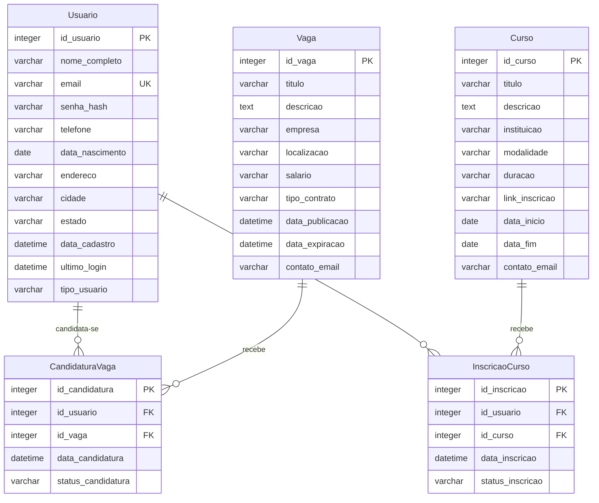

# Módulo 3: Modelagem de Banco de Dados e Controle de Versão para o Portal de Oportunidades Gratuitas.

**Autor:** Weslley Nunes 
**Data:** 10 de junho de 2025  

---

## 1. Definição do Modelo de Dados para o Portal de Oportunidades Gratuitas

Para este projeto, o modelo de dados será focado no **Portal de Oportunidades Gratuitas: Cursos e Empregos em Gurupi - TO**. O objetivo é gerenciar informações de usuários, vagas de emprego e cursos, bem como as interações dos usuários com essas oportunidades. Conforme solicitado, será dado um foco especial na entidade `Usuario` e seus dados.

### 1.1 Entidades e Atributos

As principais entidades identificadas para o sistema do Portal de Oportunidades são:

#### 1.1.1 Usuario

Representa um usuário cadastrado no portal, que pode ser um candidato a vagas, um interessado em cursos, ou um representante de empresa/instituição (para futuras expansões).

| Atributo       | Tipo de Dado | Restrições/Observações                               |
| :------------- | :----------- | :--------------------------------------------------- |
| `id_usuario`   | INTEGER      | Chave Primária, Auto Incremento, Não Nulo            |
| `nome_completo` | VARCHAR(255) | Não Nulo                                             |
| `email`        | VARCHAR(255) | Não Nulo, Único, Usado para login                    |
| `senha_hash`   | VARCHAR(255) | Não Nulo, Armazena o hash da senha                   |
| `telefone`     | VARCHAR(20)  | Pode ser Nulo                                        |
| `data_nascimento` | DATE         | Pode ser Nulo                                        |
| `endereco`     | VARCHAR(255) | Pode ser Nulo, Endereço completo do usuário          |
| `cidade`       | VARCHAR(100) | Não Nulo, Cidade de residência do usuário (Gurupi-TO) |
| `estado`       | VARCHAR(2)   | Não Nulo, Estado de residência do usuário (TO)       |
| `data_cadastro` | DATETIME     | Não Nulo, Data e hora do cadastro do usuário         |
| `ultimo_login` | DATETIME     | Pode ser Nulo, Data e hora do último acesso          |
| `tipo_usuario` | VARCHAR(50)  | Não Nulo, Ex: 'Candidato', 'Empresa', 'Instituicao'  |

#### 1.1.2 Vaga

Representa uma oportunidade de emprego divulgada no portal.

| Atributo       | Tipo de Dado | Restrições/Observações                               |
| :------------- | :----------- | :--------------------------------------------------- |\n| `id_vaga`      | INTEGER      | Chave Primária, Auto Incremento, Não Nulo            |
| `titulo`       | VARCHAR(255) | Não Nulo                                             |
| `descricao`    | TEXT         | Não Nulo                                             |
| `empresa`      | VARCHAR(255) | Não Nulo                                             |
| `localizacao`  | VARCHAR(255) | Não Nulo, Ex: 'Gurupi-TO', 'Remoto'                  |
| `salario`      | VARCHAR(100) | Pode ser Nulo, Ex: 'R$ 2.500,00', 'A combinar'       |
| `tipo_contrato` | VARCHAR(50)  | Não Nulo, Ex: 'CLT', 'PJ', 'Estágio'                 |
| `data_publicacao` | DATETIME     | Não Nulo, Data e hora da publicação da vaga          |
| `data_expiracao` | DATETIME     | Pode ser Nulo, Data limite para candidaturas         |
| `contato_email` | VARCHAR(255) | Não Nulo, Email para contato com a empresa           |

#### 1.1.3 Curso

Representa um curso de capacitação gratuito divulgado no portal.

| Atributo       | Tipo de Dado | Restrições/Observações                               |
| :------------- | :----------- | :--------------------------------------------------- |
| `id_curso`     | INTEGER      | Chave Primária, Auto Incremento, Não Nulo            |
| `titulo`       | VARCHAR(255) | Não Nulo                                             |
| `descricao`    | TEXT         | Não Nulo                                             |
| `instituicao`  | VARCHAR(255) | Não Nulo                                             |
| `modalidade`   | VARCHAR(50)  | Não Nulo, Ex: 'Presencial', 'Online', 'Híbrido'      |
| `duracao`      | VARCHAR(100) | Não Nulo, Ex: '40 horas', '3 meses'                  |
| `link_inscricao` | VARCHAR(255) | Não Nulo, URL para inscrição no curso                |
| `data_inicio`  | DATE         | Pode ser Nulo                                        |
| `data_fim`     | DATE         | Pode ser Nulo                                        |
| `contato_email` | VARCHAR(255) | Não Nulo, Email para contato com a instituição       |

#### 1.1.4 CandidaturaVaga

Registra a candidatura de um usuário a uma vaga de emprego.

| Atributo       | Tipo de Dado | Restrições/Observações                               |
| :------------- | :----------- | :--------------------------------------------------- |
| `id_candidatura` | INTEGER      | Chave Primária, Auto Incremento, Não Nulo            |
| `id_usuario`   | INTEGER      | Chave Estrangeira (referencia `Usuario.id_usuario`), Não Nulo |
| `id_vaga`      | INTEGER      | Chave Estrangeira (referencia `Vaga.id_vaga`), Não Nulo |
| `data_candidatura` | DATETIME     | Não Nulo, Data e hora da candidatura                 |
| `status_candidatura` | VARCHAR(50)  | Não Nulo, Ex: 'Pendente', 'Em Análise', 'Rejeitada', 'Contratado' |

#### 1.1.5 InscricaoCurso

Registra a inscrição de um usuário em um curso.

| Atributo       | Tipo de Dado | Restrições/Observações                               |
| :------------- | :----------- | :--------------------------------------------------- |
| `id_inscricao` | INTEGER      | Chave Primária, Auto Incremento, Não Nulo            |
| `id_usuario`   | INTEGER      | Chave Estrangeira (referencia `Usuario.id_usuario`), Não Nulo |
| `id_curso`     | INTEGER      | Chave Estrangeira (referencia `Curso.id_curso`), Não Nulo |
| `data_inscricao` | DATETIME     | Não Nulo, Data e hora da inscrição                   |
| `status_inscricao` | VARCHAR(50)  | Não Nulo, Ex: 'Confirmada', 'Pendente', 'Cancelada'  |

### 1.2 Relacionamentos

Os relacionamentos entre as entidades são:

- **Usuario 1:N CandidaturaVaga**: Um usuário pode ter muitas candidaturas a vagas.
- **Vaga 1:N CandidaturaVaga**: Uma vaga pode ter muitas candidaturas.
- **Usuario 1:N InscricaoCurso**: Um usuário pode ter muitas inscrições em cursos.
- **Curso 1:N InscricaoCurso**: Um curso pode ter muitas inscrições.

### 1.3 Diagrama Entidade-Relacionamento (DER) Conceitual



---

## 2. Implementação do Esquema do Banco de Dados (SQL)

Para a implementação do esquema do banco de dados, continuaremos utilizando SQLite. As tabelas serão criadas com base no novo modelo de dados.

### 2.1 Script de Criação das Tabelas

```sql
-- Criação da tabela Usuario
CREATE TABLE Usuario (
    id_usuario INTEGER PRIMARY KEY AUTOINCREMENT,
    nome_completo VARCHAR(255) NOT NULL,
    email VARCHAR(255) NOT NULL UNIQUE,
    senha_hash VARCHAR(255) NOT NULL,
    telefone VARCHAR(20),
    data_nascimento DATE,
    endereco VARCHAR(255),
    cidade VARCHAR(100) NOT NULL,
    estado VARCHAR(2) NOT NULL,
    data_cadastro DATETIME NOT NULL DEFAULT CURRENT_TIMESTAMP,
    ultimo_login DATETIME,
    tipo_usuario VARCHAR(50) NOT NULL
);

-- Criação da tabela Vaga
CREATE TABLE Vaga (
    id_vaga INTEGER PRIMARY KEY AUTOINCREMENT,
    titulo VARCHAR(255) NOT NULL,
    descricao TEXT NOT NULL,
    empresa VARCHAR(255) NOT NULL,
    localizacao VARCHAR(255) NOT NULL,
    salario VARCHAR(100),
    tipo_contrato VARCHAR(50) NOT NULL,
    data_publicacao DATETIME NOT NULL DEFAULT CURRENT_TIMESTAMP,
    data_expiracao DATETIME,
    contato_email VARCHAR(255) NOT NULL
);

-- Criação da tabela Curso
CREATE TABLE Curso (
    id_curso INTEGER PRIMARY KEY AUTOINCREMENT,
    titulo VARCHAR(255) NOT NULL,
    descricao TEXT NOT NULL,
    instituicao VARCHAR(255) NOT NULL,
    modalidade VARCHAR(50) NOT NULL,
    duracao VARCHAR(100) NOT NULL,
    link_inscricao VARCHAR(255) NOT NULL,
    data_inicio DATE,
    data_fim DATE,
    contato_email VARCHAR(255) NOT NULL
);

-- Criação da tabela CandidaturaVaga
CREATE TABLE CandidaturaVaga (
    id_candidatura INTEGER PRIMARY KEY AUTOINCREMENT,
    id_usuario INTEGER NOT NULL,
    id_vaga INTEGER NOT NULL,
    data_candidatura DATETIME NOT NULL DEFAULT CURRENT_TIMESTAMP,
    status_candidatura VARCHAR(50) NOT NULL,
    FOREIGN KEY (id_usuario) REFERENCES Usuario(id_usuario),
    FOREIGN KEY (id_vaga) REFERENCES Vaga(id_vaga)
);

-- Criação da tabela InscricaoCurso
CREATE TABLE InscricaoCurso (
    id_inscricao INTEGER PRIMARY KEY AUTOINCREMENT,
    id_usuario INTEGER NOT NULL,
    id_curso INTEGER NOT NULL,
    data_inscricao DATETIME NOT NULL DEFAULT CURRENT_TIMESTAMP,
    status_inscricao VARCHAR(50) NOT NULL,
    FOREIGN KEY (id_usuario) REFERENCES Usuario(id_usuario),
    FOREIGN KEY (id_curso) REFERENCES Curso(id_curso)
);
```

### 2.2 Exemplo de Dados de Usuário (CREATE)

Conforme solicitado, será fornecido um exemplo detalhado de inserção de dados para a tabela `Usuario`.

```sql
-- Inserir um Usuário de Exemplo (Candidato)
INSERT INTO Usuario (
    nome_completo, 
    email, 
    senha_hash, 
    telefone, 
    data_nascimento, 
    endereco, 
    cidade, 
    estado, 
    tipo_usuario
) VALUES (
    'Maria da Silva', 
    'maria.silva@email.com', 
    'hash_da_senha_segura_123', 
    '63991234567', 
    '1990-05-20', 
    'Rua das Flores, 123, Centro', 
    'Gurupi', 
    'TO', 
    'Candidato'
);

-- Inserir outro Usuário de Exemplo (Representante de Empresa)
INSERT INTO Usuario (
    nome_completo, 
    email, 
    senha_hash, 
    telefone, 
    cidade, 
    estado, 
    tipo_usuario
) VALUES (
    'João Oliveira', 
    'joao.oliveira@empresaabc.com', 
    'hash_da_senha_empresa_abc', 
    '63987654321', 
    'Gurupi', 
    'TO', 
    'Empresa'
);

-- Inserir um Usuário de Exemplo (Representante de Instituição)
INSERT INTO Usuario (
    nome_completo, 
    email, 
    senha_hash, 
    telefone, 
    cidade, 
    estado, 
    tipo_usuario
) VALUES (
    'Carla Souza', 
    'carla.souza@institutoedu.com', 
    'hash_da_senha_instituto_edu', 
    '63999887766', 
    'Gurupi', 
    'TO', 
    'Instituicao'
);
```

---


