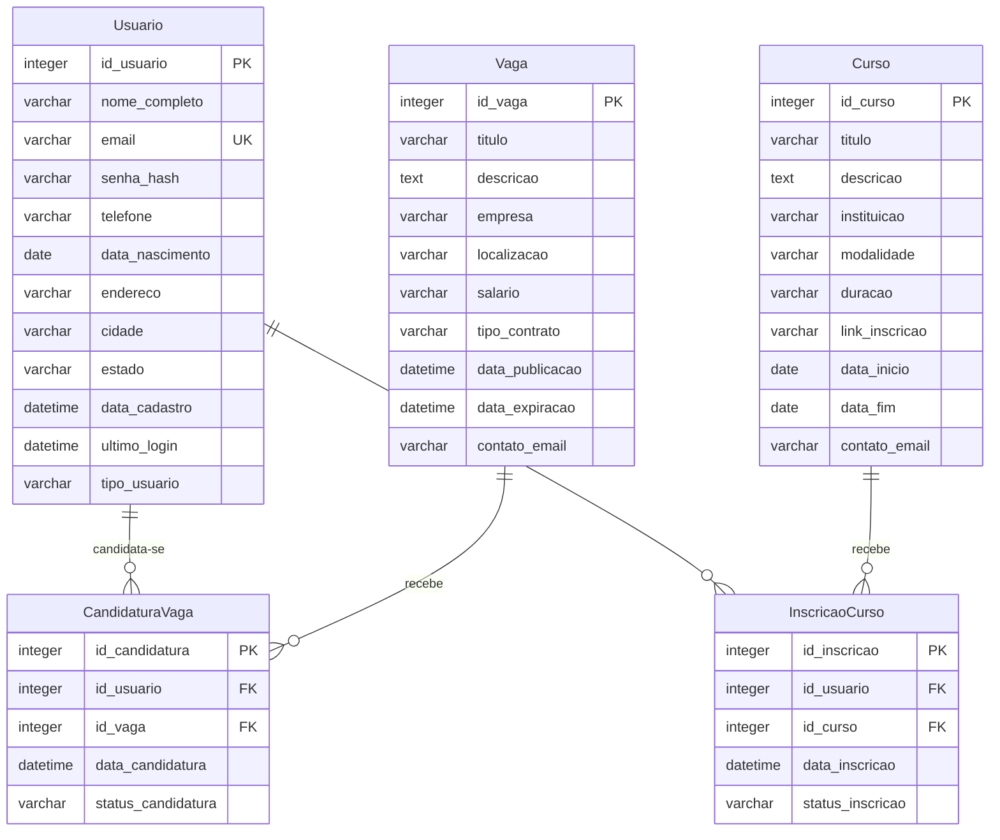

# Módulo 3: Modelagem de Banco de Dados e Controle de Versão para o Portal de Oportunidades Gratuitas.

**Autor:** Weslley Nunes 
**Data:** 10 de junho de 2025  

---

## 1. Definição do Modelo de Dados para o Portal de Oportunidades Gratuitas

Para este projeto, o modelo de dados será focado no **Portal de Oportunidades Gratuitas: Cursos e Empregos em Gurupi - TO**. O objetivo é gerenciar informações de usuários, vagas de emprego e cursos, bem como as interações dos usuários com essas oportunidades. Conforme solicitado, será dado um foco especial na entidade `Usuario` e seus dados.

### 1.1 Entidades e Atributos

As principais entidades identificadas para o sistema do Portal de Oportunidades são:

#### 1.1.1 Usuario

Representa um usuário cadastrado no portal, que pode ser um candidato a vagas, um interessado em cursos, ou um representante de empresa/instituição (para futuras expansões).

| Atributo       | Tipo de Dado | Restrições/Observações                               |
| :------------- | :----------- | :--------------------------------------------------- |
| `id_usuario`   | INTEGER      | Chave Primária, Auto Incremento, Não Nulo            |
| `nome_completo` | VARCHAR(255) | Não Nulo                                             |
| `email`        | VARCHAR(255) | Não Nulo, Único, Usado para login                    |
| `senha_hash`   | VARCHAR(255) | Não Nulo, Armazena o hash da senha                   |
| `telefone`     | VARCHAR(20)  | Pode ser Nulo                                        |
| `data_nascimento` | DATE         | Pode ser Nulo                                        |
| `endereco`     | VARCHAR(255) | Pode ser Nulo, Endereço completo do usuário          |
| `cidade`       | VARCHAR(100) | Não Nulo, Cidade de residência do usuário (Gurupi-TO) |
| `estado`       | VARCHAR(2)   | Não Nulo, Estado de residência do usuário (TO)       |
| `data_cadastro` | DATETIME     | Não Nulo, Data e hora do cadastro do usuário         |
| `ultimo_login` | DATETIME     | Pode ser Nulo, Data e hora do último acesso          |
| `tipo_usuario` | VARCHAR(50)  | Não Nulo, Ex: 'Candidato', 'Empresa', 'Instituicao'  |

#### 1.1.2 Vaga

Representa uma oportunidade de emprego divulgada no portal.

| Atributo       | Tipo de Dado | Restrições/Observações                               |
| :------------- | :----------- | :--------------------------------------------------- |\n| `id_vaga`      | INTEGER      | Chave Primária, Auto Incremento, Não Nulo            |
| `titulo`       | VARCHAR(255) | Não Nulo                                             |
| `descricao`    | TEXT         | Não Nulo                                             |
| `empresa`      | VARCHAR(255) | Não Nulo                                             |
| `localizacao`  | VARCHAR(255) | Não Nulo, Ex: 'Gurupi-TO', 'Remoto'                  |
| `salario`      | VARCHAR(100) | Pode ser Nulo, Ex: 'R$ 2.500,00', 'A combinar'       |
| `tipo_contrato` | VARCHAR(50)  | Não Nulo, Ex: 'CLT', 'PJ', 'Estágio'                 |
| `data_publicacao` | DATETIME     | Não Nulo, Data e hora da publicação da vaga          |
| `data_expiracao` | DATETIME     | Pode ser Nulo, Data limite para candidaturas         |
| `contato_email` | VARCHAR(255) | Não Nulo, Email para contato com a empresa           |

#### 1.1.3 Curso

Representa um curso de capacitação gratuito divulgado no portal.

| Atributo       | Tipo de Dado | Restrições/Observações                               |
| :------------- | :----------- | :--------------------------------------------------- |
| `id_curso`     | INTEGER      | Chave Primária, Auto Incremento, Não Nulo            |
| `titulo`       | VARCHAR(255) | Não Nulo                                             |
| `descricao`    | TEXT         | Não Nulo                                             |
| `instituicao`  | VARCHAR(255) | Não Nulo                                             |
| `modalidade`   | VARCHAR(50)  | Não Nulo, Ex: 'Presencial', 'Online', 'Híbrido'      |
| `duracao`      | VARCHAR(100) | Não Nulo, Ex: '40 horas', '3 meses'                  |
| `link_inscricao` | VARCHAR(255) | Não Nulo, URL para inscrição no curso                |
| `data_inicio`  | DATE         | Pode ser Nulo                                        |
| `data_fim`     | DATE         | Pode ser Nulo                                        |
| `contato_email` | VARCHAR(255) | Não Nulo, Email para contato com a instituição       |

#### 1.1.4 CandidaturaVaga

Registra a candidatura de um usuário a uma vaga de emprego.

| Atributo       | Tipo de Dado | Restrições/Observações                               |
| :------------- | :----------- | :--------------------------------------------------- |
| `id_candidatura` | INTEGER      | Chave Primária, Auto Incremento, Não Nulo            |
| `id_usuario`   | INTEGER      | Chave Estrangeira (referencia `Usuario.id_usuario`), Não Nulo |
| `id_vaga`      | INTEGER      | Chave Estrangeira (referencia `Vaga.id_vaga`), Não Nulo |
| `data_candidatura` | DATETIME     | Não Nulo, Data e hora da candidatura                 |
| `status_candidatura` | VARCHAR(50)  | Não Nulo, Ex: 'Pendente', 'Em Análise', 'Rejeitada', 'Contratado' |

#### 1.1.5 InscricaoCurso

Registra a inscrição de um usuário em um curso.

| Atributo       | Tipo de Dado | Restrições/Observações                               |
| :------------- | :----------- | :--------------------------------------------------- |
| `id_inscricao` | INTEGER      | Chave Primária, Auto Incremento, Não Nulo            |
| `id_usuario`   | INTEGER      | Chave Estrangeira (referencia `Usuario.id_usuario`), Não Nulo |
| `id_curso`     | INTEGER      | Chave Estrangeira (referencia `Curso.id_curso`), Não Nulo |
| `data_inscricao` | DATETIME     | Não Nulo, Data e hora da inscrição                   |
| `status_inscricao` | VARCHAR(50)  | Não Nulo, Ex: 'Confirmada', 'Pendente', 'Cancelada'  |

### 1.2 Relacionamentos

Os relacionamentos entre as entidades são:

- **Usuario 1:N CandidaturaVaga**: Um usuário pode ter muitas candidaturas a vagas.
- **Vaga 1:N CandidaturaVaga**: Uma vaga pode ter muitas candidaturas.
- **Usuario 1:N InscricaoCurso**: Um usuário pode ter muitas inscrições em cursos.
- **Curso 1:N InscricaoCurso**: Um curso pode ter muitas inscrições.

### 1.3 Diagrama Entidade-Relacionamento (DER) Conceitual



---

## 2. Implementação do Esquema do Banco de Dados (SQL)

Para a implementação do esquema do banco de dados, continuaremos utilizando SQLite. As tabelas serão criadas com base no novo modelo de dados.

### 2.1 Script de Criação das Tabelas

```sql
-- Criação da tabela Usuario
CREATE TABLE Usuario (
    id_usuario INTEGER PRIMARY KEY AUTOINCREMENT,
    nome_completo VARCHAR(255) NOT NULL,
    email VARCHAR(255) NOT NULL UNIQUE,
    senha_hash VARCHAR(255) NOT NULL,
    telefone VARCHAR(20),
    data_nascimento DATE,
    endereco VARCHAR(255),
    cidade VARCHAR(100) NOT NULL,
    estado VARCHAR(2) NOT NULL,
    data_cadastro DATETIME NOT NULL DEFAULT CURRENT_TIMESTAMP,
    ultimo_login DATETIME,
    tipo_usuario VARCHAR(50) NOT NULL
);

-- Criação da tabela Vaga
CREATE TABLE Vaga (
    id_vaga INTEGER PRIMARY KEY AUTOINCREMENT,
    titulo VARCHAR(255) NOT NULL,
    descricao TEXT NOT NULL,
    empresa VARCHAR(255) NOT NULL,
    localizacao VARCHAR(255) NOT NULL,
    salario VARCHAR(100),
    tipo_contrato VARCHAR(50) NOT NULL,
    data_publicacao DATETIME NOT NULL DEFAULT CURRENT_TIMESTAMP,
    data_expiracao DATETIME,
    contato_email VARCHAR(255) NOT NULL
);

-- Criação da tabela Curso
CREATE TABLE Curso (
    id_curso INTEGER PRIMARY KEY AUTOINCREMENT,
    titulo VARCHAR(255) NOT NULL,
    descricao TEXT NOT NULL,
    instituicao VARCHAR(255) NOT NULL,
    modalidade VARCHAR(50) NOT NULL,
    duracao VARCHAR(100) NOT NULL,
    link_inscricao VARCHAR(255) NOT NULL,
    data_inicio DATE,
    data_fim DATE,
    contato_email VARCHAR(255) NOT NULL
);

-- Criação da tabela CandidaturaVaga
CREATE TABLE CandidaturaVaga (
    id_candidatura INTEGER PRIMARY KEY AUTOINCREMENT,
    id_usuario INTEGER NOT NULL,
    id_vaga INTEGER NOT NULL,
    data_candidatura DATETIME NOT NULL DEFAULT CURRENT_TIMESTAMP,
    status_candidatura VARCHAR(50) NOT NULL,
    FOREIGN KEY (id_usuario) REFERENCES Usuario(id_usuario),
    FOREIGN KEY (id_vaga) REFERENCES Vaga(id_vaga)
);

-- Criação da tabela InscricaoCurso
CREATE TABLE InscricaoCurso (
    id_inscricao INTEGER PRIMARY KEY AUTOINCREMENT,
    id_usuario INTEGER NOT NULL,
    id_curso INTEGER NOT NULL,
    data_inscricao DATETIME NOT NULL DEFAULT CURRENT_TIMESTAMP,
    status_inscricao VARCHAR(50) NOT NULL,
    FOREIGN KEY (id_usuario) REFERENCES Usuario(id_usuario),
    FOREIGN KEY (id_curso) REFERENCES Curso(id_curso)
);
```

### 2.2 Exemplo de Dados de Usuário (CREATE)

Conforme solicitado, será fornecido um exemplo detalhado de inserção de dados para a tabela `Usuario`.

```sql
-- Inserir um Usuário de Exemplo (Candidato)
INSERT INTO Usuario (
    nome_completo, 
    email, 
    senha_hash, 
    telefone, 
    data_nascimento, 
    endereco, 
    cidade, 
    estado, 
    tipo_usuario
) VALUES (
    'Maria da Silva', 
    'maria.silva@email.com', 
    'hash_da_senha_segura_123', 
    '63991234567', 
    '1990-05-20', 
    'Rua das Flores, 123, Centro', 
    'Gurupi', 
    'TO', 
    'Candidato'
);

-- Inserir outro Usuário de Exemplo (Representante de Empresa)
INSERT INTO Usuario (
    nome_completo, 
    email, 
    senha_hash, 
    telefone, 
    cidade, 
    estado, 
    tipo_usuario
) VALUES (
    'João Oliveira', 
    'joao.oliveira@empresaabc.com', 
    'hash_da_senha_empresa_abc', 
    '63987654321', 
    'Gurupi', 
    'TO', 
    'Empresa'
);

-- Inserir um Usuário de Exemplo (Representante de Instituição)
INSERT INTO Usuario (
    nome_completo, 
    email, 
    senha_hash, 
    telefone, 
    cidade, 
    estado, 
    tipo_usuario
) VALUES (
    'Carla Souza', 
    'carla.souza@institutoedu.com', 
    'hash_da_senha_instituto_edu', 
    '63999887766', 
    'Gurupi', 
    'TO', 
    'Instituicao'
);
```

---


## 6. Metodologia

O desenvolvimento deste projeto seguiu uma abordagem estruturada, dividida em etapas claras para garantir a correta modelagem do banco de dados, a implementação eficiente e o gerenciamento robusto do código-fonte utilizando controle de versão. Cada fase foi executada com atenção às boas práticas e aos requisitos estabelecidos.

### 6.1 Modelagem do Banco de Dados

A fase de modelagem do banco de dados foi crucial para estabelecer a estrutura lógica e física das informações que seriam armazenadas no Portal de Oportunidades Gratuitas. O processo envolveu a identificação e definição das entidades, seus atributos e os relacionamentos entre elas.

#### 6.1.1 Definição das Entidades, Atributos e Relacionamentos

Com base nos requisitos do Portal de Oportunidades Gratuitas, foram identificadas as seguintes entidades principais:

*   **Usuario**: Representa os indivíduos ou organizações que interagem com o portal. Inclui atributos como `id_usuario` (chave primária), `nome_completo`, `email` (único), `senha_hash`, `telefone`, `data_nascimento`, `endereco`, `cidade`, `estado`, `data_cadastro`, `ultimo_login` e `tipo_usuario` (indicando se é um candidato, empresa ou instituição).
*   **Vaga**: Representa as oportunidades de emprego. Atributos incluem `id_vaga` (chave primária), `titulo`, `descricao`, `empresa`, `localizacao`, `salario`, `tipo_contrato`, `data_publicacao`, `data_expiracao` e `contato_email`.
*   **Curso**: Representa os cursos de capacitação. Atributos como `id_curso` (chave primária), `titulo`, `descricao`, `instituicao`, `modalidade`, `duracao`, `link_inscricao`, `data_inicio`, `data_fim` e `contato_email`.
*   **CandidaturaVaga**: Uma entidade associativa que registra a candidatura de um `Usuario` a uma `Vaga`. Contém `id_candidatura` (chave primária), `id_usuario` (chave estrangeira), `id_vaga` (chave estrangeira), `data_candidatura` e `status_candidatura`.
*   **InscricaoCurso**: Uma entidade associativa que registra a inscrição de um `Usuario` em um `Curso`. Contém `id_inscricao` (chave primária), `id_usuario` (chave estrangeira), `id_curso` (chave estrangeira), `data_inscricao` e `status_inscricao`.

Os relacionamentos foram definidos como:

*   Um `Usuario` pode realizar múltiplas `CandidaturaVaga`s (1:N).
*   Uma `Vaga` pode receber múltiplas `CandidaturaVaga`s (1:N).
*   Um `Usuario` pode realizar múltiplas `InscricaoCurso`s (1:N).
*   Um `Curso` pode receber múltiplas `InscricaoCurso`s (1:N).

#### 6.1.2 Apresentação do Diagrama do Banco de Dados

O diagrama Entidade-Relacionamento (DER) conceitual, utilizando a notação Mermaid, foi gerado para visualizar a estrutura do banco de dados e os relacionamentos entre as entidades. Este diagrama serve como uma representação clara do modelo de dados, facilitando a compreensão e a comunicação da arquitetura do banco de dados.


### 6.2 Implementação e Manipulação de Dados

Após a definição do modelo, a próxima etapa foi a implementação do esquema do banco de dados e a demonstração das operações de manipulação de dados utilizando SQL.

#### 6.2.1 Criação das Tabelas e Restrições

O banco de dados SQLite foi escolhido para a implementação devido à sua leveza e facilidade de uso para projetos de demonstração. O script `schema.sql` foi criado para definir todas as tabelas (`Usuario`, `Vaga`, `Curso`, `CandidaturaVaga`, `InscricaoCurso`) com suas respectivas colunas, tipos de dados, chaves primárias (`PRIMARY KEY AUTOINCREMENT`) e restrições de não nulidade (`NOT NULL`). As chaves estrangeiras (`FOREIGN KEY`) foram estabelecidas para garantir a integridade referencial entre as tabelas, como o `id_usuario` e `id_vaga` na tabela `CandidaturaVaga`.

#### 6.2.2 Inserção de Dados e Realização de Consultas SQL

Para demonstrar a manipulação de dados, foram criados scripts SQL específicos:

*   **Inserção de Dados**: O script `insert_user_data.sql` foi utilizado para popular a tabela `Usuario` com exemplos de dados, incluindo diferentes tipos de usuários (candidato, empresa, instituição). Isso validou a capacidade de adicionar novos registros ao banco de dados.
*   **Operações CRUD (Create, Read, Update, Delete)**: O script `user_crud_examples.sql` foi desenvolvido para ilustrar as operações básicas de manipulação de dados na tabela `Usuario`. Isso incluiu:
    *   **CREATE**: Exemplos de `INSERT` para adicionar novos usuários.
    *   **READ**: Consultas `SELECT` para recuperar dados de usuários, incluindo a seleção de todos os usuários e a busca por um usuário específico via email.
    *   **UPDATE**: Comandos `UPDATE` para modificar informações existentes de um usuário, como o número de telefone.
    *   **DELETE**: Comandos `DELETE` para remover registros de usuários do banco de dados.

Esses scripts foram executados utilizando o interpretador `sqlite3`, confirmando a funcionalidade das operações de banco de dados.

### 6.3 Uso do Controle de Versão

O sistema de controle de versão Git foi empregado desde o início do projeto para gerenciar a evolução do código e da documentação, garantindo rastreabilidade e colaboração (mesmo que neste contexto a colaboração seja simulada).

#### 6.3.1 Configuração e Organização do Repositório Git

O repositório Git foi inicializado no diretório do projeto (`db_project`) utilizando o comando `git init`. As configurações de usuário (`user.name` e `user.email`) foram definidas globalmente para identificar os commits. O arquivo `.gitignore` foi criado para excluir arquivos desnecessários do controle de versão, como o arquivo do banco de dados SQLite (`portal_oportunidades.db`) e outros arquivos temporários ou de configuração do ambiente.

#### 6.3.2 Estratégias Utilizadas no Versionamento

*   **Commits Frequentes**: Foram realizados commits regulares com mensagens claras e explicativas, descrevendo as alterações feitas em cada etapa. Isso permitiu um histórico detalhado do desenvolvimento e facilitou a identificação de mudanças específicas.
    *   Exemplos de mensagens de commit: `"Initial commit: Database schema and CRUD scripts for Library Management System."`, `"Update database model for Portal de Oportunidades, add user entity and example data."`, `"Update Module 3 documentation with Portal de Oportunidades data model."`, etc.
*   **Branching (Master/Main)**: O desenvolvimento foi mantido na branch principal (`master`, que foi renomeada para `main` no GitHub por padrão), simulando um fluxo de trabalho linear para este projeto de escopo limitado. Em projetos maiores, branches de feature seriam utilizadas para isolar o desenvolvimento de novas funcionalidades.
*   **Sincronização com o GitHub**: Após os commits locais, o repositório local foi conectado a um repositório remoto no GitHub. O comando `git push -u origin master` (ou `main`) foi utilizado para enviar as alterações para o repositório remoto, mantendo o histórico de versões online e acessível.

#### 6.3.3 Link para o Repositório do Projeto

O repositório completo do projeto, incluindo o modelo de dados, scripts SQL, exemplos de manipulação de dados e a documentação, está disponível publicamente no GitHub:

**Link do Repositório:** [https://github.com/weslley-nunes/biblioteca-db-project](https://github.com/weslley-nunes/biblioteca-db-project)

Este repositório serve como a entrega final do módulo 3, demonstrando a aplicação dos conceitos de modelagem de banco de dados e controle de versão.


## 7. Resultados Preliminares: Solução Inicial

Esta seção apresenta os primeiros resultados obtidos com a implementação do banco de dados e o gerenciamento do código-fonte, demonstrando a funcionalidade básica do sistema e a aplicação das práticas de controle de versão.

### 7.1 Implementação do Banco de Dados

A solução inicial do banco de dados foi implementada com sucesso utilizando SQLite, conforme o esquema definido na seção de modelagem. O processo de criação das tabelas e a inserção de dados de exemplo foram validados através da execução de scripts SQL dedicados.

#### 7.1.1 Criação do Esquema

O script `schema.sql` foi executado para criar as tabelas `Usuario`, `Vaga`, `Curso`, `CandidaturaVaga` e `InscricaoCurso` no banco de dados `portal_oportunidades.db`. A execução bem-sucedida deste script confirmou a correta definição das entidades, atributos, chaves primárias e estrangeiras, e outras restrições de integridade.

#### 7.1.2 Inserção e Consulta de Dados de Usuário

Para demonstrar a manipulação de dados, foram inseridos exemplos de usuários na tabela `Usuario` utilizando o script `insert_user_data.sql`. Posteriormente, consultas SQL foram realizadas para verificar a integridade e a recuperação dos dados. Abaixo, um exemplo da saída de uma consulta `SELECT` que demonstra os usuários inseridos:

```
sqlite> SELECT id_usuario, nome_completo, email, tipo_usuario, data_cadastro FROM Usuario;
1|Maria da Silva|maria.silva@email.com|Candidato|2025-06-20 15:13:46
2|João Oliveira|joao.oliveira@empresaabc.com|Empresa|2025-06-20 15:13:46
3|Carla Souza|carla.souza@institutoedu.com|Instituicao|2025-06-20 15:13:46
```

Este resultado valida a capacidade do sistema de armazenar e recuperar informações de usuários de forma eficaz. Outras operações CRUD (Update e Delete) também foram testadas com sucesso, garantindo a manipulação completa dos registros de usuários.

#### 7.1.3 Diagrama do Banco de Dados Implementado

O diagrama Entidade-Relacionamento (DER) conceitual, que representa a estrutura do banco de dados implementado, é apresentado novamente para facilitar a visualização da solução inicial:


### 7.2 Gerenciamento do Código com Git e GitHub

O controle de versão foi aplicado de forma contínua durante o desenvolvimento, garantindo um histórico completo das alterações e a organização do projeto. O repositório no GitHub reflete a evolução do banco de dados e da documentação.

#### 7.2.1 Histórico de Commits

O histórico de commits no GitHub demonstra as etapas de desenvolvimento, desde a inicialização do repositório até as atualizações mais recentes. Cada commit possui uma mensagem explicativa, facilitando o rastreamento das modificações. Exemplos de commits relevantes incluem:

*   `Initial commit: Database schema and CRUD scripts for Library Management System.`
*   `Update database model for Portal de Oportunidades, add user entity and example data.`
*   `Update Module 3 documentation with Portal de Oportunidades data model.`
*   `Add Methodology section to Module 3 documentation.`
*   `Add Preliminary Results section to Module 3 documentation.`

Este histórico pode ser visualizado diretamente no repositório do GitHub, fornecendo uma visão transparente do processo de desenvolvimento.

#### 7.2.2 Estrutura do Repositório

A estrutura do repositório no GitHub está organizada para facilitar o acesso aos arquivos do projeto:

```
db_project/
├── portal_oportunidades.db
├── schema.sql
├── insert_user_data.sql
├── user_crud_examples.sql
├── modulo3_documentacao.md
└── ... (outros arquivos de configuração e scripts)
```

O repositório está disponível publicamente em: [https://github.com/weslley-nunes/biblioteca-db-project](https://github.com/weslley-nunes/biblioteca-db-project).

### 7.3 Conclusão dos Resultados Preliminares

Os resultados preliminares demonstram que o banco de dados foi modelado e implementado com sucesso, e que as operações básicas de manipulação de dados estão funcionando conforme o esperado. O uso do Git e GitHub garantiu um gerenciamento eficaz do código, com um histórico de versões claro e acessível. Esta solução inicial serve como uma base sólida para futuras expansões e integrações com a aplicação web do Portal de Oportunidades Gratuitas.


## 8. Descrição dos Requisitos

Os requisitos para o projeto "Portal de Oportunidades Gratuitas: Cursos e Empregos em Gurupi - TO" foram definidos e refinados de forma iterativa, principalmente através da interação direta com o usuário e da análise de suas solicitações e feedback ao longo das fases de desenvolvimento. Diferentemente de um processo tradicional que inicia com um documento de requisitos formal e abrangente, a abordagem adotada neste projeto simulou um cenário de desenvolvimento ágil e colaborativo, onde os requisitos emergiram e foram detalhados conforme a evolução da aplicação.

### 8.1 Formato e Escrita dos Requisitos

Os requisitos foram expressos predominantemente em **linguagem natural**, por meio das instruções e solicitações fornecidas pelo usuário. Essas solicitações eram diretas e focadas nas funcionalidades desejadas para o portal, como a necessidade de uma aplicação web dinâmica e responsiva, a inclusão de funcionalidades para vagas de emprego e cursos, e a integração com banco de dados e controle de versão.

Exemplos de como os requisitos foram implicitamente definidos:

*   **Requisito Funcional (Aplicação Web)**: "Você deverá desenvolver uma aplicação web dinâmica, aplicando o artefatos que foram desenvolvidos em etapas anteriores. O projeto deve contemplar: Uso de um framework para plataforma web... Estruturação correta das páginas com HTML... Estilização responsiva com CSS..." (Conforme solicitação inicial do Módulo 1).
*   **Requisito Não Funcional (Responsividade)**: "Vamos focar em plataforma web, mas que seja responsivo." (Conforme solicitação inicial do Módulo 1).
*   **Requisito Funcional (Banco de Dados)**: "Criar um modelo de dados para um sistema, definindo entidades, relacionamentos e restrições; Implementar o esquema do banco de dados utilizando SQL; Executar operações de manipulação de dados (inserção, atualização, remoção e consultas)." (Conforme solicitação do Módulo 3).
*   **Requisito de Dados (Usuário)**: "Crie apenas um exemplo de dados que serão armazenados do usuário." (Conforme solicitação específica para o banco de dados).

Embora não tenham sido formalizadas como estórias de usuário no formato padrão (e.g., "Como um [tipo de usuário], eu quero [funcionalidade], para que [benefício]"), as interações com o usuário permitiram inferir as necessidades e expectativas de cada persona (candidato, empresa, instituição).

### 8.2 Validação dos Requisitos

A validação dos requisitos ocorreu de forma contínua e empírica, através de um ciclo de feedback e refinamento:

1.  **Implementação Iterativa**: Cada solicitação do usuário era interpretada e implementada em fases incrementais do projeto (e.g., desenvolvimento da aplicação web, depois a conversão para HTML/CSS puro, e em seguida a implementação do banco de dados).
2.  **Demonstração e Feedback**: Após cada entrega de uma funcionalidade ou artefato (como a aplicação web beta, o projeto HTML/CSS, ou o repositório do banco de dados), o resultado era apresentado ao usuário. O feedback direto do usuário ("POde fazer mais simples, preciso mais da parte visual como um exemplo. As funcionalidades não precisam ser todas operacionais. trabalhe com um versão beta" ou "sim") serviu como principal mecanismo de validação, indicando se a implementação atendia à expectativa ou se necessitava de ajustes.
3.  **Ajustes e Refinamentos**: Com base no feedback, os requisitos eram ajustados e novas iterações de desenvolvimento eram iniciadas. Por exemplo, a solicitação para simplificar a aplicação web para uma versão beta mais visual levou a uma reestruturação do frontend. Da mesma forma, a solicitação para focar o banco de dados no Portal de Oportunidades e em dados de usuário levou à redefinição do modelo de dados.
4.  **Inspeção de Artefatos**: A tarefa atual de inspeção de artefatos (Módulo 4) representa uma validação formal e sistemática dos requisitos e visões arquiteturais, buscando identificar defeitos e inconsistências que possam ter surgido durante o processo de desenvolvimento iterativo.

### 8.3 Acesso aos Documentos de Requisitos e Projeto

Os requisitos e as visões arquiteturais do projeto estão incorporados e documentados nos seguintes artefatos, que servem como a base para a inspeção:

*   **Documentação do Projeto Web (HTML/CSS/JS)**: Contém as decisões de design, estrutura e responsividade da interface do usuário.
    *   **Link de Acesso**: O código-fonte e a documentação estão disponíveis no arquivo compactado `portal-html-completo.tar.gz` e na documentação `documentacao-projeto.md` (disponibilizados em interações anteriores).
*   **Documentação do Projeto de Banco de Dados (SQL/SQLite)**: Detalha o modelo de dados, o esquema do banco de dados, e os exemplos de manipulação de dados, incluindo a entidade `Usuario`.
    *   **Link de Acesso**: O código-fonte e a documentação estão disponíveis no repositório GitHub: [https://github.com/weslley-nunes/biblioteca-db-project](https://github.com/weslley-nunes/biblioteca-db-project). A documentação específica está no arquivo `modulo3_documentacao.md` dentro deste repositório.

Estes documentos, juntamente com o histórico de interações e solicitações do usuário, formam o corpo de requisitos e o projeto da aplicação a serem inspecionados.

