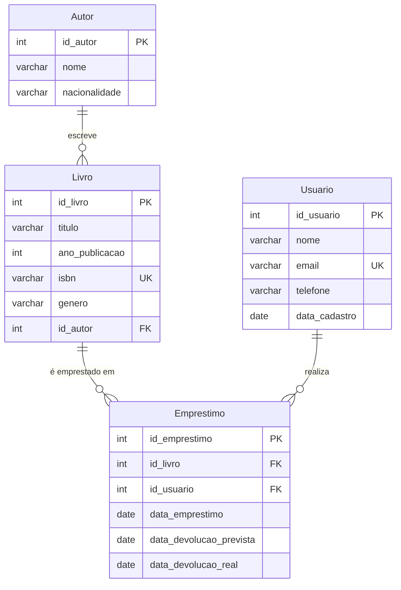

# Módulo 3: Modelagem de Banco de Dados e Controle de Versão

**Autor:** Manus AI  
**Data:** 20 de junho de 2025  

---

## 1. Definição do Modelo de Dados

Para este projeto, será desenvolvido um modelo de dados para um sistema de **Gerenciamento de Biblioteca**. Este sistema permitirá o registro de livros, autores, usuários e o controle de empréstimos. A escolha deste domínio se justifica pela sua simplicidade e clareza na representação de entidades e relacionamentos comuns em bancos de dados.

### 1.1 Entidades e Atributos

As principais entidades identificadas para o sistema de biblioteca são:

#### 1.1.1 Livro

Representa um item físico ou digital disponível na biblioteca.

| Atributo       | Tipo de Dado | Restrições/Observações                               |
| :------------- | :----------- | :--------------------------------------------------- |
| `id_livro`     | INT          | Chave Primária, Auto Incremento, Não Nulo            |
| `titulo`       | VARCHAR(255) | Não Nulo                                             |
| `ano_publicacao` | INT          | Não Nulo, Ano de publicação do livro                 |
| `isbn`         | VARCHAR(13)  | Não Nulo, Único (ISBN-13)                            |
| `genero`       | VARCHAR(100) | Não Nulo                                             |
| `id_autor`     | INT          | Chave Estrangeira (referencia `Autor.id_autor`), Não Nulo |

#### 1.1.2 Autor

Representa o autor de um ou mais livros.

| Atributo       | Tipo de Dado | Restrições/Observações                               |
| :------------- | :----------- | :--------------------------------------------------- |
| `id_autor`     | INT          | Chave Primária, Auto Incremento, Não Nulo            |
| `nome`         | VARCHAR(255) | Não Nulo                                             |
| `nacionalidade` | VARCHAR(100) | Não Nulo                                             |

#### 1.1.3 Usuario

Representa um membro da biblioteca que pode pegar livros emprestados.

| Atributo       | Tipo de Dado | Restrições/Observações                               |
| :------------- | :----------- | :--------------------------------------------------- |
| `id_usuario`   | INT          | Chave Primária, Auto Incremento, Não Nulo            |
| `nome`         | VARCHAR(255) | Não Nulo                                             |
| `email`        | VARCHAR(255) | Não Nulo, Único                                      |
| `telefone`     | VARCHAR(20)  | Pode ser Nulo                                        |
| `data_cadastro` | DATE         | Não Nulo, Data em que o usuário foi cadastrado       |

#### 1.1.4 Emprestimo

Registra os empréstimos de livros feitos pelos usuários.

| Atributo       | Tipo de Dado | Restrições/Observações                               |
| :------------- | :----------- | :--------------------------------------------------- |
| `id_emprestimo` | INT          | Chave Primária, Auto Incremento, Não Nulo            |
| `id_livro`     | INT          | Chave Estrangeira (referencia `Livro.id_livro`), Não Nulo |
| `id_usuario`   | INT          | Chave Estrangeira (referencia `Usuario.id_usuario`), Não Nulo |
| `data_emprestimo` | DATE         | Não Nulo, Data em que o livro foi emprestado         |
| `data_devolucao_prevista` | DATE         | Não Nulo, Data prevista para devolução               |
| `data_devolucao_real` | DATE         | Pode ser Nulo, Data real de devolução (se devolvido) |

### 1.2 Relacionamentos

Os relacionamentos entre as entidades são:

- **Autor 1:N Livro**: Um autor pode escrever muitos livros, mas um livro é escrito por apenas um autor (simplificação para este modelo).
- **Livro N:M Emprestimo**: Um livro pode ser emprestado muitas vezes, e um empréstimo pode envolver muitos livros (embora para simplificar, cada empréstimo será de um único livro neste modelo).
- **Usuario 1:N Emprestimo**: Um usuário pode fazer muitos empréstimos, mas um empréstimo é feito por apenas um usuário.

### 1.3 Diagrama Entidade-Relacionamento (DER) Conceitual



---

## 2. Implementação do Esquema do Banco de Dados (SQL)

Para a implementação do esquema do banco de dados, será utilizado SQLite, um sistema de gerenciamento de banco de dados relacional que não requer um servidor separado, sendo ideal para projetos pequenos e demonstrações. As tabelas serão criadas com base no modelo de dados definido anteriormente.

### 2.1 Script de Criação das Tabelas

```sql
-- Criação da tabela Autor
CREATE TABLE Autor (
    id_autor INTEGER PRIMARY KEY AUTOINCREMENT,
    nome VARCHAR(255) NOT NULL,
    nacionalidade VARCHAR(100) NOT NULL
);

-- Criação da tabela Livro
CREATE TABLE Livro (
    id_livro INTEGER PRIMARY KEY AUTOINCREMENT,
    titulo VARCHAR(255) NOT NULL,
    ano_publicacao INTEGER NOT NULL,
    isbn VARCHAR(13) NOT NULL UNIQUE,
    genero VARCHAR(100) NOT NULL,
    id_autor INTEGER NOT NULL,
    FOREIGN KEY (id_autor) REFERENCES Autor(id_autor)
);

-- Criação da tabela Usuario
CREATE TABLE Usuario (
    id_usuario INTEGER PRIMARY KEY AUTOINCREMENT,
    nome VARCHAR(255) NOT NULL,
    email VARCHAR(255) NOT NULL UNIQUE,
    telefone VARCHAR(20),
    data_cadastro DATE NOT NULL
);

-- Criação da tabela Emprestimo
CREATE TABLE Emprestimo (
    id_emprestimo INTEGER PRIMARY KEY AUTOINCREMENT,
    id_livro INTEGER NOT NULL,
    id_usuario INTEGER NOT NULL,
    data_emprestimo DATE NOT NULL,
    data_devolucao_prevista DATE NOT NULL,
    data_devolucao_real DATE,
    FOREIGN KEY (id_livro) REFERENCES Livro(id_livro),
    FOREIGN KEY (id_usuario) REFERENCES Usuario(id_usuario)
);
```

### 2.2 Operações de Manipulação de Dados (CRUD)

Serão demonstradas as operações básicas de CRUD (Create, Read, Update, Delete) para cada uma das entidades.

#### 2.2.1 Inserção de Dados (CREATE)

```sql
-- Inserir Autores
INSERT INTO Autor (nome, nacionalidade) VALUES (
    'Machado de Assis', 'Brasileira'
);
INSERT INTO Autor (nome, nacionalidade) VALUES (
    'Clarice Lispector', 'Brasileira'
);
INSERT INTO Autor (nome, nacionalidade) VALUES (
    'Gabriel Garcia Marquez', 'Colombiana'
);

-- Inserir Livros
INSERT INTO Livro (titulo, ano_publicacao, isbn, genero, id_autor) VALUES (
    'Dom Casmurro', 1899, '9788508127002', 'Romance', 1
);
INSERT INTO Livro (titulo, ano_publicacao, isbn, genero, id_autor) VALUES (
    'Memórias Póstumas de Brás Cubas', 1881, '9788508127019', 'Romance', 1
);
INSERT INTO Livro (titulo, ano_publicacao, isbn, genero, id_autor) VALUES (
    'A Hora da Estrela', 1977, '9788532504221', 'Romance', 2
);
INSERT INTO Livro (titulo, ano_publicacao, isbn, genero, id_autor) VALUES (
    'Cem Anos de Solidão', 1967, '9788501012626', 'Realismo Mágico', 3
);

-- Inserir Usuários
INSERT INTO Usuario (nome, email, telefone, data_cadastro) VALUES (
    'Ana Silva', 'ana.silva@example.com', '11987654321', '2024-01-15'
);
INSERT INTO Usuario (nome, email, telefone, data_cadastro) VALUES (
    'Bruno Costa', 'bruno.costa@example.com', NULL, '2024-02-20'
);
INSERT INTO Usuario (nome, email, telefone, data_cadastro) VALUES (
    'Carla Dias', 'carla.dias@example.com', '21998765432', '2024-03-10'
);

-- Inserir Empréstimos
INSERT INTO Emprestimo (id_livro, id_usuario, data_emprestimo, data_devolucao_prevista, data_devolucao_real) VALUES (
    1, 1, '2025-06-01', '2025-06-15', NULL
);
INSERT INTO Emprestimo (id_livro, id_usuario, data_emprestimo, data_devolucao_prevista, data_devolucao_real) VALUES (
    3, 2, '2025-06-05', '2025-06-19', '2025-06-18'
);
INSERT INTO Emprestimo (id_livro, id_usuario, data_emprestimo, data_devolucao_prevista, data_devolucao_real) VALUES (
    4, 1, '2025-06-10', '2025-06-24', NULL
);
```

#### 2.2.2 Consulta de Dados (READ)

```sql
-- Selecionar todos os livros
SELECT * FROM Livro;

-- Selecionar livros de um autor específico (Machado de Assis)
SELECT L.titulo, A.nome AS autor_nome
FROM Livro L
JOIN Autor A ON L.id_autor = A.id_autor
WHERE A.nome = 'Machado de Assis';

-- Selecionar usuários e seus empréstimos atuais
SELECT U.nome AS usuario_nome, L.titulo AS livro_titulo, E.data_emprestimo, E.data_devolucao_prevista
FROM Emprestimo E
JOIN Usuario U ON E.id_usuario = U.id_usuario
JOIN Livro L ON E.id_livro = L.id_livro
WHERE E.data_devolucao_real IS NULL;

-- Contar o número de livros por gênero
SELECT genero, COUNT(*) AS total_livros
FROM Livro
GROUP BY genero;
```

#### 2.2.3 Atualização de Dados (UPDATE)

```sql
-- Atualizar o telefone de um usuário
UPDATE Usuario
SET telefone = '11991234567'
WHERE email = 'ana.silva@example.com';

-- Registrar a devolução de um livro
UPDATE Emprestimo
SET data_devolucao_real = '2025-06-19'
WHERE id_emprestimo = 1;
```

#### 2.2.4 Remoção de Dados (DELETE)

```sql
-- Remover um usuário (e seus empréstimos, se houver CASCADE DELETE configurado, ou manualmente)
DELETE FROM Usuario
WHERE email = 'bruno.costa@example.com';

-- Remover um livro
DELETE FROM Livro
WHERE isbn = '9788532504221';
```

---


